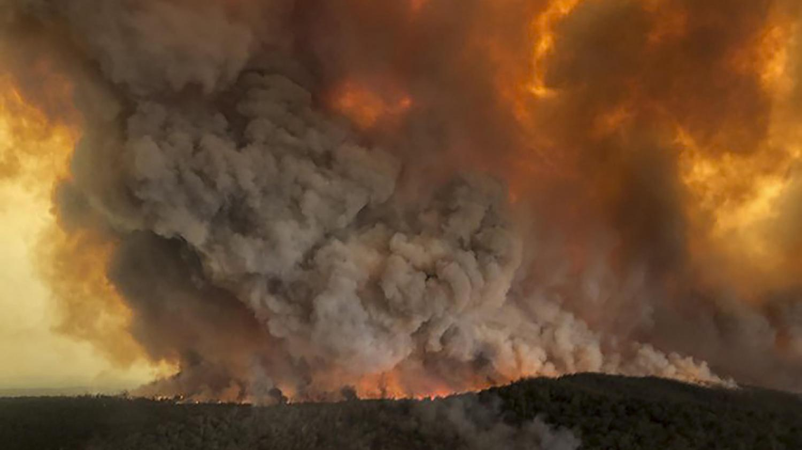

# FIRE IN CLOUD - Recovery after disaster in Azure public cloud - REAL STORY



## Introduction
I decided to write this story, as I have to solve some unusual situation last week.  

At the beginning I must say, that I tried to describe a real story of disaster in Azure public cloud infrastructure which has been previously designed with combination of Distributed Architecture together with apply DevOps principles and [12factor](https://12factor.net/) methodology.  
I wanted to come back and look around to just think about each step in Disaster recovery together with talk about not/applied anti/patterns given by that principles/methodology.

I am also so sorry for any grammar/spelling mistakes, I was hurry up during writing this article with only one aim -> to share my small experience solving this use case with anybody.

## What happened?  
I used to realize projects with delivery of Cloud native architecture in public cloud (focused on Microsoft Azure at this time) and I use to realize projects with delivery of:
- Architecture design
- Realization of such design including definition of Infrastructure as A code
- SoftwareDevelopmentLifecycle changes -> DevOps including CI/CD pipeline, for infrastructure and applications   

So, this is simply my daily bread.  

Come to that, what has happened:  
... one day, my phone is ringing, and I had incoming call of one business owner of company/project (let's mark that project as "R"), which I realized in past.
I delivered them design and realization of distributed architecture Infrastructure as a code, realization of all infrastructure and application pipelines in past. Everything I delivered for them in past I committed to their repository, including documentation in markdown, etc.  

The man from "R" project has had a clear message:  
"... Adam, everything is fu**ed up, nothing works, there is nobody who can help us, except from you. Can you help?"

You can imagine that nowadays guy who likes DevOps culture and "cloud native" attitude (as me), have still a lot of work as there is a pressure for automation from the trade generally, so in that days you say often "I am sorry, I am already allocated and do not have enough time for anything else".  

But that situation, was different, that customer/project was something like a little baby for me, that company is a small startup and doing a cool product with using Machine Learning to help other companies to safe costs, it is Czech technological company and moreover ... if I do not help them, then a months or years of work a few people would just come to its definition end.  

Of course, anybody could come and help them, as I told, everything was written in code, but the time and possible knowledge of environment was a key, because if recovery has not been realized As Soon As Possible, then customers of "R" project would not give them another opportunity.

In other words, I was not thing so much about any other way then immediately help them.  

## Architecture design of solution

I would like to describe you quickly and basically solution design of that infrastructure (I will describe it only as a high level).
Just imagine, that infrastructure:
- everything in Azure public cloud (except from DNS records of public domains)
- One Azure Active Directory (AAD) tenant, One subscription
- Generally 3 stages (tst,staging,prd)
- Application layer composed from Azure kubernetes clusters (AKS), application stack was heterogenous, composed mainly from Python, .Net etc.
- Data persistent layer composed of:
  * ElasticCloudOnKubernetes (ELK) in separate AKS clusters (yes really, Stateful sets deployed in k8s)
  * Azure Storage Accounts (PV's and PVS's for AKS)
  * Mongo DB in IaaS layer
  * Azure SQL databases (using backup of functionality of that PaaS services)
- other Azure services
  * (user assigned, system assigned) managed identities, for controlling access among services and follow 0trust methodology
  * Azure KeyVaults, mostly for storage Encryption keys (we used Encryption At Rest with customer managed keys saved in KeyVault, also there is a lot of application releated secrets and AKS clusters are integrated with AzureKeyVaults using [akv2k8s.io](http://akv2k8s.io) CRD )
  * services for messaging, like Azure Services Bus
  * services for monitoring, like Log analytics workspaces
  * other services (Azure cache for redis, etc ... )...

Such infrastructure has been delivered by me in past written as a code using [Bicep](https://docs.microsoft.com/en-us/azure/azure-resource-manager/bicep/overview?tabs=bicep) domain specific language.   

You can find parts of such code [here](/projectr-aks/01-azure-infrastructure/). It was parametrized in a way to use one code for delivery in more stages... in other meanings you have parametrized Infrastructure Code and Build and Release pipelines, repository has its own branches and based on commit in particular branch build pipeline is publishing releasable artifacts and release pipeline is assuring, that artifacts are safely released in the right stage based on source branch it has been build from.  
We used **Azure DevOps** service for all that stuff, as well as we cloud use Github or any other similar service/product.

You can find some infra build pipelines [here](/projectr-aks/00-pipeline/) and some scripts using in release pipeline [here](/projectr-aks/02-kubernetes-core/). You can also see I used mix of declarative and imperative attitude there, I personally prefer declarative way of definition, but sometimes imperative way is much quicker with the same or similar results. Such scripts do not have a high maturity level and do not solve negative way of behavior, so you should probably have much more complicated reusable scripts with checking each per-checks and post-checks to orchestrate better procedure or improve such maturity in you pipeline by running steps based on result codes given from the previous steps.  

That DevOps principle is the same for infrastructure as for application, no matter if we speak about one or second. Artifacts are versioned with tags and reusable in case something happen (rollbacks etc...)

Such principle and infrastructure/app pattern is critical for a speed of recovery (Recovery Time Objective = RTO) in my use case ... just follow this article.

## DAY 1

### Analysis - what's wrong with infrastructure

So, after emergency call, I got access to the infrastructure and started to analyze it.  
Make it short ... I can say, there was some "engineer" in past, who, trying to do something, but in fact he detached subscription with all that described resources from one AAD tenant and to another (and then put it back).

There is special sentence for that man who did this work (hoping he could read this article):   
** !!! PLEASE NEVER EVER DO IT SIMILAR STAFF TO ANOTHER CUSTOMER UNLESS YOU ARE 100% SURE YOU KNOW WHAT YOU ARE EXACTLY DOING AND WHAT IS IMPACT OF YOUR CHANGES !!! **

If you imagine, what can happen, as every Azure Infrastructure and its management plane is always fully dependent on AAD tenant, to which every subscription must be connected with.

Just focus on security and using an "Encryption At Rest" technology using your own encryption keys (BYOK, HYOK, etc..) ... you have AKS cluster with its managed identities, which must have access to disk encryption sets, where are referenced encryption keys to Azure KeyVault instances, and there must be correct Role Based Access (RBAC defined) if that is realized, but if access is broken or encryption keys are lost, then forget you can decrypt data, which is exactly something you never want to happen.
There are plenty of other dependencies connected with AAD tenant and resources, but for now let's stay with this one as example.

Now I must say to everyone, do not forget about what Microsoft says in its documentation for Azure KeyVault instance content, **you should have such content in other place also**.

I have looked mostly around all components of failing infrastructure and come to the statements:
- there are probably data not touched by that change, the biggest issue for whole infrastructure and application is that nothing has access to nothing (is seems that Recovery Point Objective = RPO will be 0 or at least a really small value )
- after adding proper roles at subscription level I could see, that instances of Azure KeyVaults including its data (Encryption keys and Secrets) are there ... if not ... old data using scription backups could be used (if you have right backups after last key rotations)
- there is definition of RoleBasedAccessControl(RBAC) as a part of my delivery, but there are a lot of other stuff defined "handy" in subscription by other people in past, so that staff (non-functionalities) should be subject of troubleshooting and redefinition (because it has not been described by code ... no matter if you use declarative or imperative way)
- it will be not ease to use even actual infrastructure as a code, as it uses older API versions, there was nobody who cared about that environment for a lot of months, so also old versions of kubernetes and other components is here
- elastic cloud on kubernetes (ELK) is defined as stateful set, there has not been delivered any backup/recovery scenario, as business says, we use it only for "cache", we can rebuild that data anytime ... but anyway I know I must be really careful about process how to make Elastic work, to try to not destroy any data on Persistent Volumes ...
- there is everything in Azure DevOps in a meaning source codes for infrastructure/application definition
- there are a lot of versions (including lates released) of app artifacts in Azure Container Registry (if not source code and build pipelines would be more critical subject)

So now, I can ask you for a few questions:
- can you imagine you lose your AAD tenant??
- can you imagine what really happen?
- how do you define RBAC in your Azure environment?
- does your backup/recovery processes (if there are any) count with loosing AAD and complete control over your infrastructure?

### Set up strategy for recovery
There was a call with business owner after analysis and I realized that trouble has been connected also with some basic per subscription type limitation (after conversion from sponsorship subscription to another type of offerID), we decided that, I will try to make everything work by redeployment of application layer in different subscription (CSP) and try to solve any other issues with persistent layer in actual subscription. 

Key is time to market and try to **SURVIVE**, priority is not clean code, nice infrastructure, priority is a time and data availability.

So, sprint for life has just started, challange accepted,  ...

## DAY 2,3
I talked about that situation with family, choose right playlists and fight with time started.    

I repaired quickly issues with VPN connection to allow access people to internal company services.  

I had to start a reverse engineering of my own code and started to hate my own work delivered in past, or at least in a manner of saying ... "OMG why I did it that way? it is awful" but then immediately realized/remembered, that there were some reasons for doing so in past ... (low cost project, time, money, tech reasons, whatever).

So, to be realy short in that way ... I reused all InfrastructureAsACode I written in past and just started to commit new changes to Dev branch as I have to change variables, parameters, versions and sometime also the code itself, as services evolved, structure of code must be changed during service evolution and braking changes non-absence.

So, I had to do redeployment and in the same time upgrade infrastructure with big version differences, I just type some of them:
- AzureKubernetesService (Microsoft.ContainerService/managedClusters@2020-12-01 -> Microsoft.ContainerService/managedClusters@2022-04-01 )
- Kubernetes (k8s) (version 1.19.9 -> 1.23.8)
- Infra-App Pipelines (all needed variables, parameters changes, new service connections, etc...)
- controllers inside k8s, cert-manager (1.3.1->1.8.0), ingress... etc.

Finally 3 new stages has been created completely with all needed components and releases pipelines assured with other script changes next deployment all needed staff inside AKS clusters:
- controllers (cert-manager, ingress, akv2k8s, etc)
- namespaces
- configmaps
- akv objects (mapping to k8s secrets, but they did not work, as there are no secrets in new KeyVault instances)

Then immediately, I focused on Azure Key Vault instances and its content ... I added needed role "Azure KeyVault Administrator" on source and destination subscription and then I looked on the content, it seemed that all needed data are here, so I decide not to use old backups, but using backup/recovery scripts I exported all content in a loop from that Azure Key Vault instances:

Just imagine such easy backup script (content was edited so it is not like the real one):

```bash
#!/bin/bash
VAULTNAME=mykvname
SUBSCRIPTIONID=00000000-0000-0000-0000-000000000000
SECRETS='
  SECRET1
  AKS-PERS-STORAGE-KEY
  APPLICATIONINSIGHTS-COMPUTE-CONNSTRING
  ELASTIC-HOST
  ELASTIC-PORT
  ELASTIC-USER
  MONGO-DBNAME
  MONGO-HOST
  MONGO-PASSWORD
  MONGO-USER
  REDIS-COMPUTE-CONNSTRING
  SERVICEBUS-UNIVERSAL-CONNSTRING
  SQL-CONNECTION-STRING
  SQL-DB-NAME
  SQL-HOST
  SQL-PASSWORD
  SQL-USERNAME
  '
for i in $SECRETS
do
  az keyvault secret backup --file $i --name $i --vault-name $VAULTNAME --subscription $SUBSCRIPTIONID
  echo $i
done

```
Then I realized that I cannot using such backups with my recovery scripts for scenarios of cross subscription (same AAD tenant) recovery, so I let that backup for purpose of real backup and I have to recreate that secrets by hand as it was quickest solution for particular situation.

Then I did the same backup in new KeyVaults once the data was here.

Then I jumped in Elastic Cloud in Kubernetes (ELK in k8s) ... a little nightmare for me, as I was not confident about result so much, but I used methodology, in which I will read all declarative code, then compare with running environment and do the possible changes only by myself, to know exact change and result.

In case I speak about RBAC of ELK in k8s, I had to do at least these role assignments in Azure management plane for my deployment:
- for Disk encryption set, reassign "Keyvault crypto service encryption user" role to encryption key
- for User Assigned Managed identity, reassign  "reader" role to disk encryption set
- for OMS agent reassign "Monitoring metrics publisher" role to aks cluster

It seemed that nothing happened as workers of AKS cluster has not been still in ready yet ... but manual restart of one worker in scale set lead into making AKS to care about anything rest what was needed to make Elastic and Kibana to work.

It took me about 2 days and about 23 releases doing fastfail effort to reach it ... in a meaing I spend 8 hours daily on that, as I had to put other hours of day to other project and sometimes a little sleep.

As a result of that effort there were 3 stages completely prepared for app deployment.

## DAY 4

As I already written, we use Azure DevOps (ADO), for code repository, pipelines, generally all CI/CD staff.

All app build pipelines are written in YAML format, for all releases we used ADO's multistage releases with integration to source pipeline and it's built artifacts.

I prefer to use yaml releases nowadays, but no matter how it is, that's it.

There is one important technical aspect in this infrastructure realization, and it is using structured of environment variables group, which are in realized in hierarchy of global/app/stage groups with clear aim to not to redefine variables many times in pipelines as such realization is little time demanding at the beginning but leads into better and cleaner variables lifecycle.

So no matter, if we use graphical or yaml releases, linking such pipelines with well structured variable groups is key in case you need to change variable with effect to many pipelines, and definiction of such pipelines using right variables/parameters and not hardcode anything which should not be there is real key in case you need to do bulk changes.

I must say that such principle was totally KEY in case you seek time to market in a disaster recovery process, If you do it well, then you have much lower Recovery Time Objective (RTO), which is exactly what you need in case of disaster usually.

In other words, I only changed a few variables (after service connection re-setup) ... changed some needed tasks and code of scripts because of version changes and then I was able to release applications with exact same versions to the destination stages. You just follow logs in release pipelines to get knowledge about last app version released before disaster and you release the same binary version in new infrastructure.

It is the same binary artifact as in previous infrastructure, so we talk about one important principle and it is idempotency, in our containerized words ... 

As all deployments/services/pods seems to be ok in all k8s clusters, I came back to the business owner with request of application testing.

## Outcomes

There are these outcomes as per my observation:
- RTO took about 4 days and could be lower (2 or 1 day) in case resources (like myself) were better allocated, in a meaning of wider team of people with 1 men coordinating others would lead by sure to the lower RTO, as technology was not limitation in that case, having ability to full focus on recovery is high valuable in case when you need it
- in case that all infrastructure is defined as a code (not partially) would definitely lead into smaller RTO
- if there are regular environment maintenance and smooth version upgrades, it would lead into smaller RTO
- you should be really careful in case using of Crypto shredding (using EncryptionAtRest with customer managed keys) to include all needed processes in your disaster recovery scenarios, use that type of data security only with full definition of data/app lifecycle, start with key rotation practice
- combination of DevOps principles and technologies, together with containerized Distributed architecture still persuade myself to be very good pattern and much easier for disaster recovery than old monolithic solutions which I could see in past


